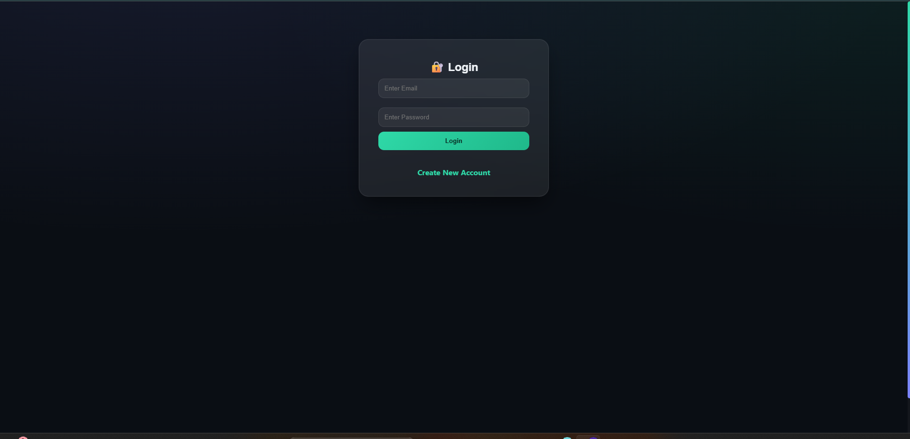
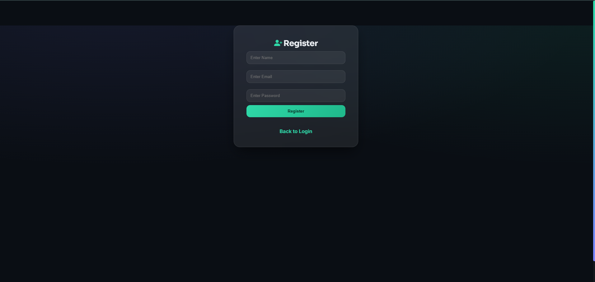
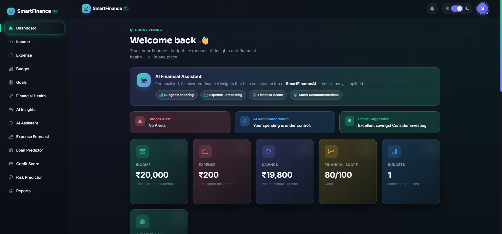
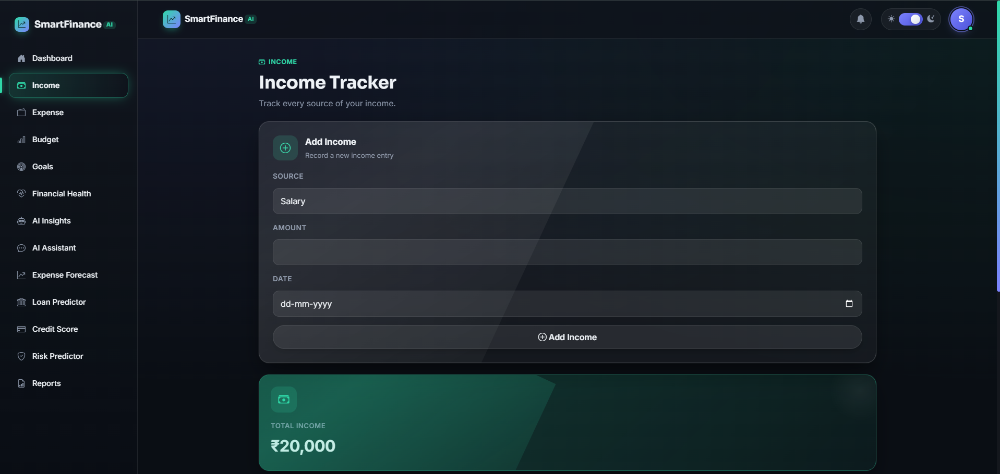
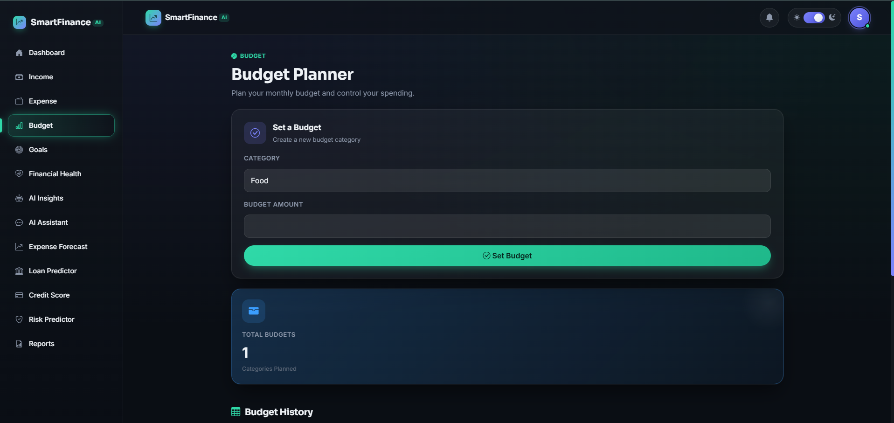
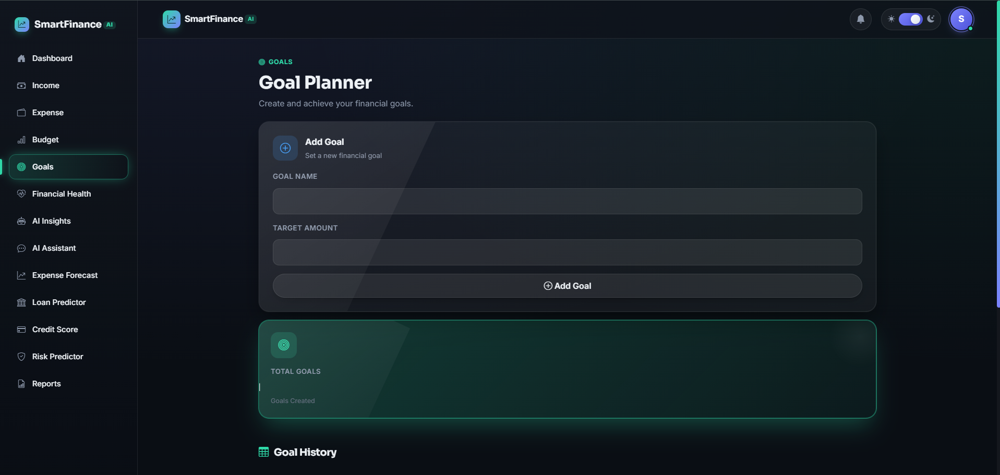
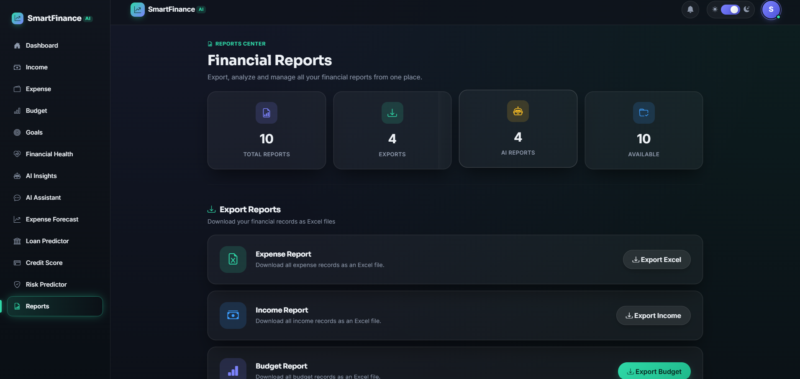
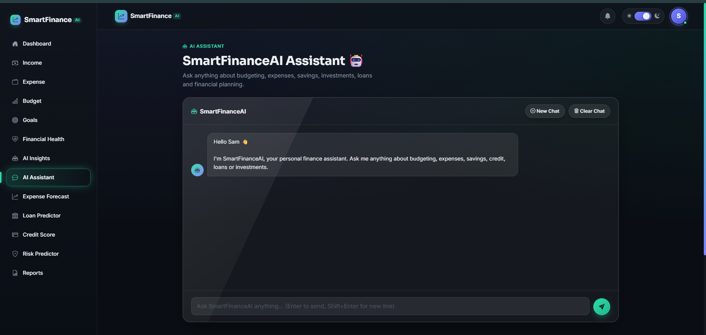
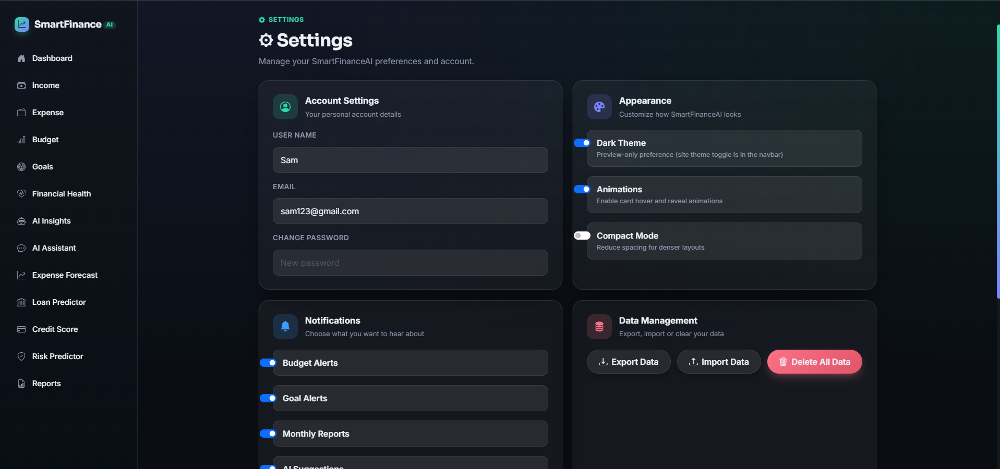

<div align="center">

# 💰 SmartFinanceAI

**An AI-Powered Personal Finance Management Web Application built with Flask**

SmartFinanceAI helps users track income and expenses, plan budgets, set savings goals, and get AI-driven insights into their financial health — combining traditional finance-tracking tools with machine learning predictions and a conversational AI assistant.


</div>

---

## 📖 Overview

SmartFinanceAI is a full-stack Flask web application that centralizes personal finance management into a single dashboard. Users can log income and expenses, plan category-wise budgets, track savings goals, and view an interactive analytics dashboard. On top of the core tracking features, the app layers five distinct AI/ML capabilities — an expense predictor, an expense forecaster, a loan eligibility predictor, a credit score classifier, and a financial risk classifier — plus a Gemini-powered conversational finance assistant.

## 🎯 Problem Statement

Most people struggle to get a consolidated, real-time view of their income, spending, and savings progress, and rarely have access to predictive tools that tell them what their financial future might look like based on their own historical data.

## ✅ Solution

SmartFinanceAI solves this by combining:

- A structured income/expense/budget/goal tracking system scoped per authenticated user.
- Machine learning models trained to classify loan eligibility, credit score tier, and financial risk level.
- A linear regression model that learns from the user's own expense history to predict next month's spending.
- A Gemini-based AI chat assistant that answers personal finance questions in context.
- A visual, glassmorphism-themed dashboard with live Chart.js analytics.

---

## ✨ Key Features

### 🔐 Authentication Features
- User registration with duplicate-email protection (`/register`)
- Secure login with hashed password verification (`/login`)
- Session-based authentication using Flask sessions
- `login_required` decorator protecting all financial routes
- Logout with full session clearing (`/logout`)

### 🏠 Dashboard Features
- Real-time KPI cards: Total Income, Total Expense, Savings, Financial Score, Active Budgets, Current Goal
- Auto-calculated **Financial Score** (0–100) with status labels (Excellent / Good / Average / Poor) based on savings
- Budget-exceeded alert banner (e.g. Food budget overspend warning)
- AI-generated recommendation and smart suggestion cards
- Goal progress bar (target vs. current savings)
- Two live Chart.js visualizations: Expense-by-Category (pie chart) and Budget-vs-Expense (bar chart)
- Quick Action tiles linking to every module

### 💵 Income Module
- Add income entries with source (Salary, Freelancing, Scholarship, Business, Other), amount, and date
- Auto-generated notification on each new income entry
- Full income history table with running total
- Data scoped per logged-in user

### 💸 Expense Module
- Add expense entries with category (Food, Travel, Shopping, Bills), amount, and date
- Category-based search/filter (`GET /expense?search=...`)
- Delete individual expense records
- Auto-generated notification on each new expense entry
- Full expense history table with running total

### 📊 Budget Module
- Create category-wise budgets (Food, Travel, Shopping, Bills, Education)
- Budget count KPI and full budget history table
- Used by the dashboard to trigger overspend alerts

### 🎯 Goals Module
- Create financial goals with a name and target amount
- Delete goals
- Goal progress automatically calculated as `(savings / target_amount) × 100` and displayed on the dashboard

### 📑 Reports Module
- Export Expense, Income, Budget, and Goal records to Excel (`.xlsx`) via dedicated download routes
- CSV import for bulk-adding expense records, with automatic column normalization and UTF-8/Latin-1 encoding fallback
- Central Reports Center page linking to every export and every AI prediction tool

### ⚙️ Settings Module
- Update username (with uniqueness check), email (with regex validation), and password (min-length enforced) from one form
- Per-user appearance preferences: Dark Theme, Animations, Compact Mode (persisted in a dedicated `UserSettings` table)
- Per-user notification preferences: Budget Alerts, Goal Alerts, Monthly Reports, AI Suggestions
- "Delete All Data" action that wipes all of a user's expenses, income, budgets, and goals
- Flash messages for success/error feedback

---

## 🤖 AI Features

| Feature | Route | How It Works |
|---|---|---|
| **AI Expense Prediction** | `/predict` | Trains a fresh scikit-learn `LinearRegression` model on the user's own expense sequence (minimum 5 records) to predict the next expense value |
| **Expense Forecast AI** | `/forecast` | Loads a pre-trained regression model (`expense_model.pkl`) and predicts expenses for a given month number |
| **Loan Eligibility Predictor** | `/loan` | Loads a pre-trained classification model (`loan_model.pkl`) to approve/reject based on income and credit score |
| **Credit Score Predictor** | `/credit` | Loads a pre-trained classification model (`credit_model.pkl`) to classify credit tier (Low / Medium / High) from a 7-feature financial profile |
| **Financial Risk Predictor** | `/risk` | Loads a pre-trained classification model (`risk_model.pkl`) to classify risk as Low / Medium / High from a 6-feature profile including debt ratio and prior defaults |
| **Financial Health Score** | `/financial_health` | Computes an average income/expense health score from a bundled reference dataset (`data/finance_dataset.csv`) |
| **AI Financial Assistant** | `/assistant` | A Gemini-powered chat assistant with a custom financial-advisor persona, session-based conversation history (capped at 20 exchanges), "New Chat" and "Clear Chat" controls |

## 🧠 Machine Learning Models Used

| Model File | Route | Task Type |
|---|---|---|
| `loan_model.pkl` | `/loan` | Binary classification (loan approval) |
| `credit_model.pkl` | `/credit` | Multi-class classification (credit tier) |
| `risk_model.pkl` | `/risk` | Multi-class classification (risk level) |
| `expense_model.pkl` | `/forecast` | Regression (expense forecasting by month) |
| *(in-memory)* `LinearRegression` | `/predict` | Regression, trained live on the user's own expense history |

All classifier/regressor models are pre-trained and loaded at request time via Python's `pickle` module from the `saved_models/` directory.

---

## 🛠️ Technologies Used

### Backend
- Python 3
- Flask
- Flask-SQLAlchemy (ORM)
- Werkzeug (`generate_password_hash` / `check_password_hash`)
- python-dotenv (environment variable management)

### Frontend
- Jinja2 templates
- Bootstrap 5.3.3
- Bootstrap Icons 1.11.3
- Google Fonts (Sora, Inter)
- Chart.js (Expense-by-Category and Budget-vs-Expense charts)
- Custom CSS — dark-themed glassmorphism design system with scroll-reveal animations
- Vanilla JavaScript (theme toggle, sidebar, notifications, chat UI, chart rendering)

### Database
- SQLite (`finance.db`), accessed via Flask-SQLAlchemy
- Tables: `User`, `Expense`, `Income`, `Budget`, `Goal`, `Notification`, `UserSettings`

### Machine Learning
- scikit-learn (`LinearRegression`, plus pickled classifiers/regressors for loan, credit, risk and forecast prediction)
- NumPy
- pandas (data handling, Excel export, CSV import, health score calculation)

### AI API
- Google Generative AI SDK (`google-generativeai`)
- Model: `gemini-2.5-flash`

---

## 🏗️ Project Architecture

```
Browser (Bootstrap + Chart.js + Vanilla JS)
        │
        ▼
Flask Routes (app.py)
   ├── Auth & Session Layer  →  login_required decorator
   ├── CRUD Modules          →  Income / Expense / Budget / Goal
   ├── ML Inference Layer    →  pickle-loaded scikit-learn models
   ├── Live Training Layer   →  LinearRegression on user expense history
   ├── Gemini AI Layer       →  google-generativeai chat completion
   └── Export/Import Layer   →  pandas ↔ Excel/CSV
        │
        ▼
SQLAlchemy ORM  →  SQLite (finance.db)
```

## 📁 Folder Structure

```
SmartFinanceAI/
├── app.py
├── requirements.txt
├── .env
├── .gitignore
├── README.md
├── finance.db
├── data/
│   └── finance_dataset.csv
├── saved_models/
│   ├── loan_model.pkl
│   ├── credit_model.pkl
│   ├── risk_model.pkl
│   └── expense_model.pkl
├── static/
│   ├── style.css
│   └── script.js
└── templates/
    ├── base.html
    ├── login.html
    ├── register.html
    ├── dashboard.html
    ├── income.html
    ├── expense.html
    ├── budget.html
    ├── goal.html
    ├── financial_health.html
    ├── prediction.html
    ├── forecast.html
    ├── forecast_result.html
    ├── loan.html
    ├── loan_result.html
    ├── credit.html
    ├── credit_result.html
    ├── risk.html
    ├── risk_result.html
    ├── reports.html
    ├── settings.html
    ├── profile.html
    ├── assistant.html
    ├── help.html
    └── import_data.html
```

---

## 📸 Screenshots

> Click any screenshot to view it at full resolution.

### 🔐 Authentication

<table>
<tr>
<td width="50%" align="center">

**Login**

[]

</td>
<td width="50%" align="center">

**Register**

[]

</td>
</tr>
</table>

### 🏠 Dashboard

The main dashboard gives an at-a-glance view of income, expenses, savings, financial score, and AI-generated recommendations.

[]

### 💵 Income & 💸 Expense

<table>
<tr>
<td width="50%" align="center">

**Income Tracker**

[]

</td>
<td width="50%" align="center">

**Expense Tracker**

[]

</td>
</tr>
</table>

### 📊 Budget & 🎯 Goals

<table>
<tr>
<td width="50%" align="center">

**Budget Planner**

[]

</td>
<td width="50%" align="center">

**Goal Planner**

[]

</td>
</tr>
</table>

### 📑 Reports Center

Export financial records to Excel or import expenses from CSV, all from a single hub.

[]

### 🤖 AI Assistant

A Gemini-powered conversational assistant for personalized financial guidance.

[]

### ⚙️ Settings

Manage account details, appearance preferences, notification settings, and data management options.

[]

---

## ⚙️ Installation Guide

### 1. Clone the Repository

```bash
git clone https://github.com/<Tanuja Singh>/SmartFinanceAI.git
cd SmartFinanceAI
```

### 2. Create a Virtual Environment

```bash
# Windows
python -m venv venv
venv\Scripts\activate

# macOS / Linux
python3 -m venv venv
source venv/bin/activate
```

### 3. Install Dependencies

```bash
pip install -r requirements.txt
```

### 4. Configure Environment Variables

Create a `.env` file in the project root:

```env
SECRET_KEY=your-flask-secret-key
GEMINI_API_KEY=your-google-gemini-api-key
```

> `SECRET_KEY` signs Flask session cookies. `GEMINI_API_KEY` authenticates the AI Assistant with Google's Generative AI API. Never commit this file — it is already covered by `.gitignore`.

### 5. Run the Application

```bash
python app.py
```

On first run, `db.create_all()` automatically creates `finance.db` with all required tables. The app will be available at:

```
http://127.0.0.1:5000
```

---

## 🔄 Application Workflow

1. **Register** a new account or **log in** with existing credentials.
2. Land on the **Dashboard**, showing a live snapshot of income, expenses, savings, financial score, budgets, and goal progress.
3. Log entries via **Income**, **Expense**, **Budget**, and **Goals**.
4. Visit **AI Insights**, **Expense Forecast**, **Loan Predictor**, **Credit Score**, or **Risk Predictor** to run the relevant ML model against entered data.
5. Chat with the **AI Assistant** for personalized financial guidance.
6. Use **Reports** to export data to Excel or import expenses from CSV.
7. Adjust preferences and manage account/data from **Settings**.

---

## 🔒 Security Features

- Passwords hashed with Werkzeug's `generate_password_hash` / verified with `check_password_hash` — never stored in plaintext
- Session-based authentication guarded by a `login_required` decorator on protected routes
- Secrets (`SECRET_KEY`, `GEMINI_API_KEY`) loaded from environment variables via `python-dotenv`, never hard-coded
- Server-side email format validation and username-uniqueness checks in Settings
- Minimum password length enforcement on password change
- All financial queries filtered by `user_id`, preventing cross-user data access

## 👥 Multi-user Support

Every core table (`Expense`, `Income`, `Budget`, `Goal`) is linked to `User` via a `user_id` foreign key, and every query is scoped to `session["user_id"]`, ensuring each account only ever sees and modifies its own financial data. Per-user appearance and notification preferences are stored separately in `UserSettings`.

## 🔁 Import / Export Features

- **Export:** Expense, Income, Budget, and Goal records can each be downloaded as standalone `.xlsx` files.
- **Import:** Expense records can be bulk-imported from a `.csv` file. The importer normalizes column names, supports both UTF-8 and Latin-1 encodings, and validates that `Category`, `Amount`, and `Date` columns are present before committing records.

---

## 🌟 Project Highlights

- Five distinct AI/ML-driven modules covering prediction, forecasting, and classification
- A fully conversational, persona-driven AI Assistant powered by Google Gemini
- Custom-built glassmorphism dark UI with scroll-reveal animations and animated KPI counters
- Per-user data isolation and persisted UI/notification preferences
- One-click Excel export and CSV bulk import for financial records

## 🚀 Future Enhancements

- Add unit and integration tests for routes and ML inference paths
- Migrate raw SQL-style queries to fully typed SQLAlchemy models with migrations (Flask-Migrate)
- Add pagination to Income/Expense/Budget/Goal history tables
- Add API rate-limiting and input sanitization hardening for production deployment
- Support multi-currency tracking

---

## 🤝 Contributing

Contributions are welcome!

1. Fork the repository
2. Create a feature branch (`git checkout -b feature/your-feature`)
3. Commit your changes (`git commit -m "Add your feature"`)
4. Push to the branch (`git push origin feature/your-feature`)
5. Open a Pull Request

## 👤 Author

**Tanuja Singh**

## 🙏 Acknowledgements

- [Flask](https://flask.palletsprojects.com/) — web framework
- [scikit-learn](https://scikit-learn.org/) — machine learning models
- [Google Generative AI](https://ai.google.dev/) — Gemini-powered assistant
- [Bootstrap](https://getbootstrap.com/) & [Bootstrap Icons](https://icons.getbootstrap.com/) — UI framework
- [Chart.js](https://www.chartjs.org/) — data visualization

## 📬 Support / Contact

For questions, issues, or feedback, please open an issue on this repository.

---

<p align="center">Built with ❤️ using Flask and Machine Learning</p>